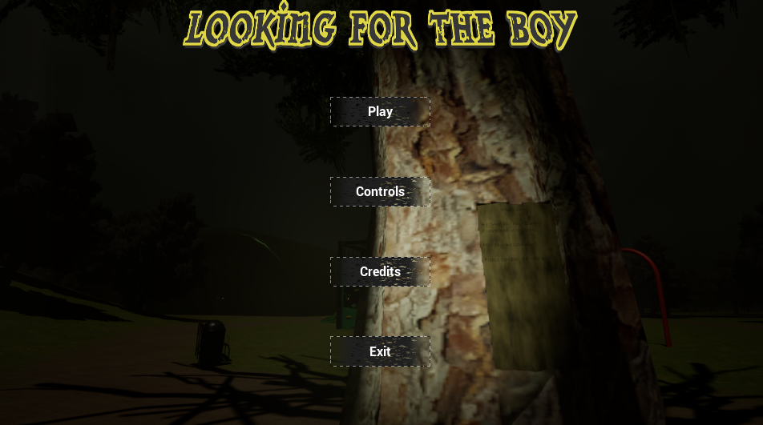

# LookingForTheBoy
<i>Current version: 1.1.1</i>

## About Game
This is a short, first, person, stealth, exploration game made with UE5 inspired by "Trumpets"(1). It was made with UE5. 
[Trailer](https://youtube.com/shorts/PzluxGmxCtI?feature=share) 
[Gameplay](https://youtu.be/DXx6ffoSjwk)

## Plot
Player is looking for missing boy in park. Main character quickly realises that boy was kidnapped by cultist and finds a key to theirs lair. Player's task is to find a key to main room to save the boy. During exploration, player can find more info about them. 

## Controls
W, A, S, D -> moving 
Mouse -> camera 
Hold Shift -> Run 
F - > Flashlight 
E, R - > Interract with objects 

## Technical
There are 3 levels:
  - Menu
  - Outside
  - Inside

Menu: 
 
Outside: 

Inside: 

 
**Interractions** 
Player can interract with highlighted objects by looking on them and pressing 'R'. Game uses a line trace to check if player is looking on object and if it is possible to interract. If these conditions are met, game passes player's signal to object by interface. 
Text words on screen, which player sees when character is speaking, are the same widget called <i>Charactes Word</i> with different parameters. 
 
**Running and stamina** 
When player's running, stamina is being used. When shift is released, it slowly returns back to full. If stamina is full, stamina widget is not visible. While running, player speeds up from 600 to 1000. Player is able to run for about 10 seconds, before stamina runs out. 
 
**Key System** 
Player's character has an array - type boolean. When player collects a key, an array elements - with specyfic index - is set to 'true'. When player interract with door, it checks if player character has an element in array set on true. If yes, then open. Else player says info about locked door. Here is full list of indexes and doors: 
0 - door to technical room 
1 - door to conference room 
2 - door to Boss Room 
3 - door to Boss Office 
4 - door to Library 
 
<i>Some doors do not need keys or use other variables outside the array.</i> 
 
**Monster** 
Monster is in "Inside" level. It walks randomly in area, but it can't enter to rooms. 
When it sees player it starts following. Monster stops when:
  * loses player (player enters to room or runs away)
  * kills player 
  
When monster sees player and is close enough, player starts taking damage. Monster needs c.a. 5 seconds to kill player. 
When player runs away, his health is restored immediately. 
Monster makes step noises. It has a step sound placed in its animation.
 
## Credits
Game was made by Miki18. 
Models are from Fab and my own. 
Music - Kevin MacLeod 
Sound effects - Soundspace Sound Effects and Sound Effects Database

## Notes
1. https://tbitcoding.itch.io/trumpets-demo

Developed with Unreal Engine 5.5.4
